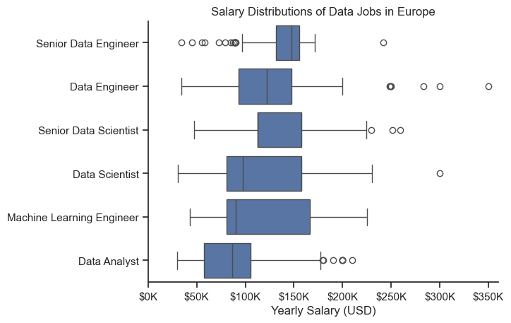
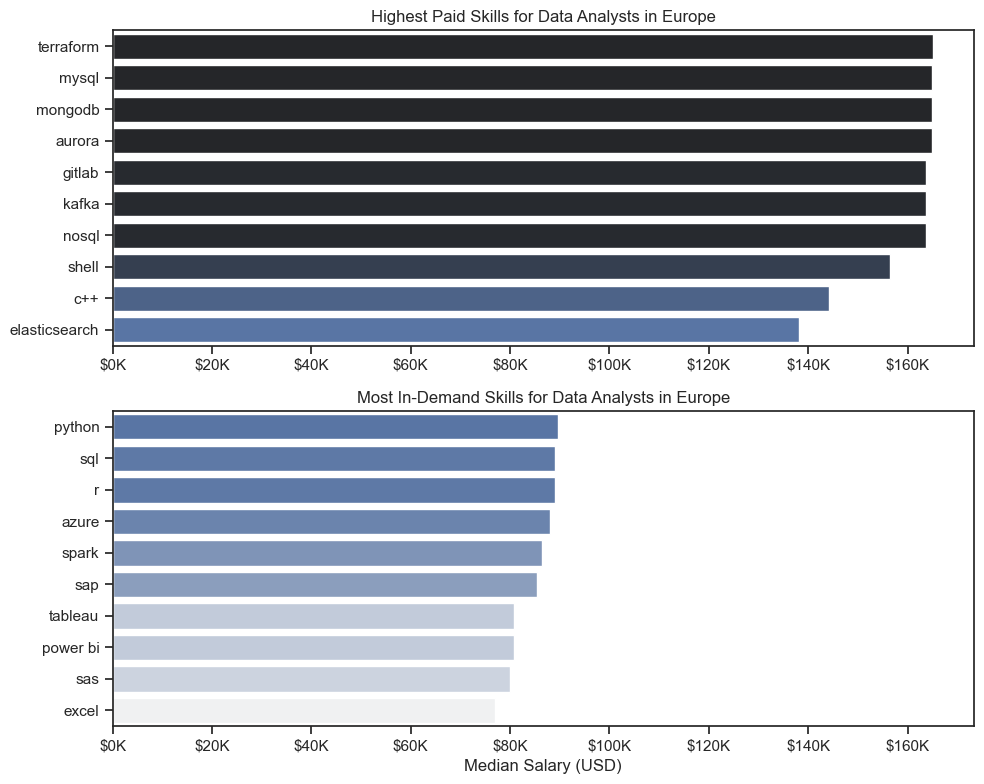
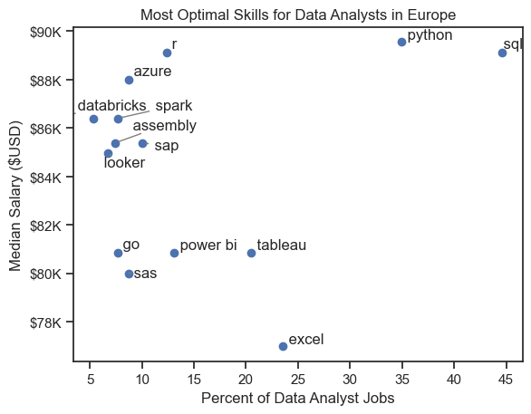
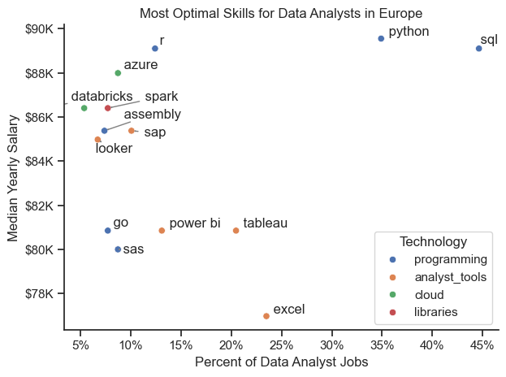

# Overview
This project explores the Data Analyst job market with a focus on identifying the most valuable skills to learn.  

Starting from a France-based perspective for the first two parts, I then extend the analysis to major European data markets (United Kingdom, Germany, France, and the Netherlands) to ensure more robust and reliable insights.  

Using a dataset sourced from Luke Barousse’s Python course, which includes job titles, salaries, locations, and required skills, I analyze key aspects of the data job market.  

Through a series of Python analyses and visualizations, I investigate which skills are the most in-demand, which offer the highest salaries, and how combining both can help identify the most optimal skills for Data Analysts.


# The Questions
Below are the questions I want to answer in my project:

1. What are the skills most in demand for the top 3 most popular data roles?
2. How are in-demand skills trending for Data Analysts?
3. How well do jobs and skills pay for Data Analysts?
4. What are the optimal skills for data analysts to learn? (High Demand AND High Paying)

# Tools I Used
For my deep dive into the data analyst job market, I harnessed the power of several key tools:

- Python: The backbone of my analysis, allowing me to analyze the data and find critical insights.I also used the following Python libraries:
    - Pandas Library: This was used to analyze the data.
    - Matplotlib Library: I visualized the data.
    - Seaborn Library: Helped me create more advanced visuals.
- Jupyter Notebooks: The tool I used to run my Python scripts which let me easily include my notes and analysis.
- Visual Studio Code: My go-to for executing my Python scripts.
- Git & GitHub: Essential for version control and sharing my Python code and analysis, ensuring collaboration and project tracking.


# Data Preparation and Cleanup
This section outlines the steps taken to prepare the data for analysis, ensuring accuracy and usability.

## Import & Clean Up Data
I start by importing necessary libraries and loading the dataset, followed by initial data cleaning tasks to ensure data quality.

```python
# Importing Libraries
import ast
import pandas as pd
import seaborn as sns
from datasets import load_dataset
import matplotlib.pyplot as plt  

# Loading Data
dataset = load_dataset('lukebarousse/data_jobs')
df = dataset['train'].to_pandas()

# Data Cleanup
df['job_posted_date'] = pd.to_datetime(df['job_posted_date'])
df['job_skills'] = df['job_skills'].apply(lambda x: ast.literal_eval(x) if pd.notna(x) else x)
```

## Countries Filters 
In the first two parts of my analysis, focusing on the french job market, I apply filters to the dataset, narrowing down to roles based in France.

```python
df_FR = df[df['job_country'] == 'France']
```

For the last two parts of my analysis, since there were many job postings that did not list a salary, I expand the scope beyond France to include major European data markets. 

I filter the dataset to focus on the United Kingdom, Germany, France, and the Netherlands, ensuring a balance between data availability and market consistency.

```python
countries = ['United Kingdom', 'Germany', 'France', 'Netherlands']
df_EU = df[df['job_country'].isin(countries)]
```


# The Analysis
Each Jupyter notebook for this project aimed at investigating specific aspects of the data job market. Here’s how I approached each question:
## 1. What are the most demanded skills for the top 3 most popular data roles?
To identify the most in-demand skills across the three most popular data roles, I first filtered the dataset to focus on the most common positions. Then, I extracted the top five skills associated with each of these roles. This analysis highlights the key job titles and their most relevant skills, helping me understand which competencies to prioritize based on the role I aim to pursue.

View my notebook with detailed steps here: [2_Skill_Demand](3_Project/2_Skill_Demand.ipynb)
#### Visualize Data

```python
fig, ax = plt.subplots(len(job_titles), 1)


for i, job_title in enumerate(job_titles):
    df_plot = df_skills_perc[df_skills_perc['job_title_short'] == job_title].head(5)[::-1]
    sns.barplot(data=df_plot, x='skill_percent', y='job_skills', ax=ax[i], hue='skill_count', palette='dark:b_r')

plt.show()
```
#### Results


*Bar chart illustrating the salaries for the top three data roles, along with the five key skills associated with each of them.*
#### Insights:
- SQL is a core skill across all three roles, ranking at or near the top every time, making it essential regardless of the data career path.
- Data Engineers stand out with more technical and infrastructure-focused requirements, including tools like Spark and cloud platforms (AWS, Azure), showing a stronger emphasis on big data and system architecture.
- Python is key for Data Scientists and Data Engineers, while Data Analysts rely more on business intelligence tools like Power BI, Tableau, and Excel, reflecting a more business-oriented role.

## 2. How are in-demand skills trending for Data Analysts?

To analyze how skills evolved throughout 2023 for Data Analysts, I filtered the dataset to include only relevant roles and grouped the required skills by the posting month. This allowed me to identify the top five skills for each month, highlighting how their popularity changed over the year.

View my notebook with detailed steps here: [3_Skills_Trend](3_Project/3_Skills_Trend.ipynb).

#### Visualize Data

```python
df_plot = df_DA_FR_percent.iloc[:, :5]
sns.lineplot(data=df_plot, dashes=False, legend=False, palette='tab10')

plt.gca().yaxis.set_major_formatter(PercentFormatter(decimals=0))

plt.show()
```
#### Results


*Bar graph visualizing the trending top skills for data analysts in France in 2023.*

#### Insights
- SQL remains the most consistently in-demand skill across all months, maintaining a high level throughout the year with noticeable peaks in summer and early autumn. This confirms its central role in Data Analyst positions in France.
- Python follows a similar pattern but with slightly more variation, reaching a strong peak in summer. This suggests an increased demand for more advanced analytical and technical skills during that period.
- BI tools (Power BI and Tableau) show moderate but stable demand, with occasional increases during mid-year. This indicates they are regularly required but less dominant compared to core technical skills like SQL and Python.
- Excel remains relatively stable at a lower level, suggesting it is a baseline skill expected across roles rather than a key differentiator in the job market.

## 3. How well do jobs and skills pay for Data Analysts?
To identify the highest-paying roles and skills, I focus on major European data markets (United Kingdom, Germany, France, and the Netherlands) and analyze median salaries to ensure robust comparisons.  

But first I examine the salary distribution of common data roles such as Data Analyst, Data Engineer, and Data Scientist to understand overall compensation differences.  
This provides a foundation for identifying which roles and skills offer the highest earning potential.

View my notebook with detailed steps here: [4_Salary_Analysis](3_Project/4_Salary_Analysis.ipynb)

#### Visualiza Data

```python
sns.boxplot(data=df_EU_top6, x='salary_year_avg', y='job_title_short', order=job_order)

ticks_x = plt.FuncFormatter(lambda y, pos: f'${int(y/1000)}K')
plt.gca().xaxis.set_major_formatter(ticks_x)
plt.show()
``` 
#### Results


*Box plot visualizing the salary distributions for the top 6 data job titles.*

#### Insights

- There is a clear difference in salary levels across data roles in Europe, with senior positions such as Senior Data Engineer and Senior Data Scientist offering the highest median salaries. This reflects the strong value placed on experience and advanced technical expertise.
- Technical roles such as Data Engineer, Machine Learning Engineer, and Data Scientist show higher salary ranges and greater variability compared to Data Analyst roles. This indicates that more specialized and technical positions tend to offer both higher pay and a wider range of compensation.
- Senior roles exhibit a larger spread in salaries, with several high-end outliers, suggesting that compensation can vary significantly depending on experience, company, and responsibilities. In contrast, Data Analyst roles show more consistent and concentrated salary ranges, indicating less variability in compensation.

### Highest Paid & Most Demanded Skills for Data Analysts

Next, I narrow the analysis to Data Analyst roles across selected European countries (United Kingdom, Germany, France, and the Netherlands).  

#### Visualize Data

```python
fig, ax = plt.subplots(2, 1)  

# Top 10 Highest Paid Skills for Data Analysts
sns.barplot(data=df_DA_top_pay, x='median', y=df_DA_top_pay.index, hue='median', ax=ax[0], palette='dark:b_r')

# Top 10 Most In-Demand Skills for Data Analysts
sns.barplot(data=df_DA_skills, x='median', y=df_DA_skills.index, hue='median', ax=ax[1], palette='light:b')

plt.show()
```

#### Results 


*Two separate bar graphs visualizing the highest paid skills and most in-demand skills for data analysts in top European countries.*

### Insights

- The top chart shows that more specialized and technical skills such as Terraform, Kafka, and MongoDB are associated with the highest salaries, suggesting that advanced infrastructure and data engineering-related skills can significantly increase earning potential for Data Analysts.
- The bottom chart highlights that foundational and widely used tools like Python, SQL, and Excel are the most in-demand skills. These skills are essential for employability, even if they are not always linked to the highest salaries.
- There is a clear gap between the highest-paying skills and the most in-demand ones. This suggests that Data Analysts can benefit from combining strong core skills (Python, SQL) with more specialized tools to maximize both job opportunities and salary potential.

## 4. What is the most optimal skill to learn for Data Analysts?
To identify the most valuable skills to learn, I analyze both their demand (percentage of job postings) and their associated median salary across European Data Analyst roles.  

This approach allows me to highlight the skills that offer the best combination of strong market demand and high earning potential.

View my notebook with detailed steps here: [5_Optimal_Skills](3_Project/5_Optimal_Skills.ipynb)

#### Visualize Data

```python
from adjustText import adjust_text
import matplotlib.pyplot as plt

plt.scatter(df_DA_skills_high_demand['skill_percent'], df_DA_skills_high_demand['median_salary'])
plt.show()
```

#### Results


*A scatter plot visualizing the most optimal skills (high paying & high demand) for data analysts in top European countries.*

#### Insights
- Core skills like SQL and Python stand out as the most optimal, combining both high demand and high median salaries. This makes them essential skills for Data Analysts aiming to maximize both employability and earning potential in Europe.
- Specialized or less common skills such as R, Azure, and Databricks offer relatively high salaries despite lower demand, suggesting that niche technical expertise can lead to strong compensation opportunities.
- Widely used tools like Excel, Tableau, and Power BI are highly востребed but associated with lower median salaries, indicating that while they are important for getting a job, they are less differentiating in terms of salary growth.

### Visualizing Different Technologies

To enrich the analysis, I group skills by technology categories (e.g., Programming, Cloud, BI tools) and use color coding in the visualization to highlight patterns across different types of skills.

#### Visualize Data

```python
from matplotlib.ticker import PercentFormatter

# Create a scatter plot
scatter = sns.scatterplot(
    data=df_DA_skills_tech_high_demand,
    x='skill_percent',
    y='median_salary',
    hue='technology',  # Color by technology
    palette='bright',  # Use a bright palette for distinct colors
    legend='full'  # Ensure the legend is shown
)
plt.show()
```

#### Results


*A scatter plot visualizing the most optimal skills (high paying & high demand) for data analysts in top European countries with color labels for technology.*

#### Insights

- Programming skills (e.g., Python, SQL, R) dominate the upper-right area of the chart, combining high demand with high salaries. This highlights their central role and strong value in the European Data Analyst job market.
- Cloud and data engineering-related skills (e.g., Azure, Databricks) tend to offer higher salaries despite lower demand, indicating that more advanced technical expertise is well rewarded even if less frequently required.
- Analyst tools (e.g., Excel, Tableau, Power BI) are more concentrated in the lower part of the chart, showing high demand but comparatively lower salaries. This suggests they are essential baseline skills but less differentiating in terms of compensation.

# What I Learned
Throughout this project, I deepened my understanding of the data analyst job market and enhanced my technical skills in Python, especially in data manipulation and visualization. Here are a few specific things I learned:

- **Advanced Python Usage:** Utilizing libraries such as Pandas for data manipulation, Seaborn and Matplotlib for data visualization, and other libraries helped me perform complex data analysis tasks more efficiently.
- **Data Cleaning Importance:** I learned that thorough data cleaning and preparation are crucial before any analysis can be conducted, ensuring the accuracy of insights derived from the data.
- **Strategic Skill Analysis:** The project emphasized the importance of aligning one's skills with market demand. Understanding the relationship between skill demand, salary, and job availability allows for more strategic career planning in the tech industry.

# Insights

This project highlights several key insights into the Data Analyst job market in Europe:

- **Demand vs Salary Trade-off:** Core skills such as SQL and Python offer the best balance between high demand and strong salaries, making them essential for maximizing career opportunities.

- **Value of Specialized Skills:** More advanced or niche skills (e.g., cloud and data engineering tools) tend to be associated with higher salaries despite lower demand, highlighting their strong market value.

- **Role Differentiation:** There is a clear distinction between business-oriented roles (Data Analyst) and more technical roles (Data Engineer, Data Scientist), reflected in both required skills and salary distributions.

- **Technology Segmentation:** Programming skills dominate the most optimal zone (high demand & high salary), while analyst tools (Excel, Tableau, Power BI) are widely required but less differentiating in terms of compensation.


# Challenges I Faced

This project involved several challenges that helped strengthen my data analysis skills:

- **Limited Data Availability (France):** The French dataset alone was not sufficient for robust analysis, which required expanding the scope to other European countries while maintaining consistency.

- **Data Inconsistencies:** Handling missing or inconsistent data entries requires careful consideration and thorough data-cleaning techniques to ensure the integrity of the analysis.

- **Complex Data Visualization:** Designing effective visual representations of complex datasets was challenging but critical for conveying insights clearly and compellingly.

- **Balancing Breadth and Depth:** Deciding how deeply to dive into each analysis while maintaining a broad overview of the data landscape required constant balancing to ensure comprehensive coverage without getting lost in details.


# Conclusion

This project provides a comprehensive view of the Data Analyst job market in Europe, highlighting the skills that matter most in terms of both demand and salary.  

By combining multiple analyses, it shows that the most valuable skills are those that balance strong demand with high earning potential, particularly programming skills like SQL and Python. It also emphasizes the importance of complementing foundational skills with more advanced or specialized tools to stand out in the job market.  

Overall, this project offers actionable insights for anyone looking to build or advance a career in any data science role, while also demonstrating the importance of adapting analysis scope and methodology based on data availability.