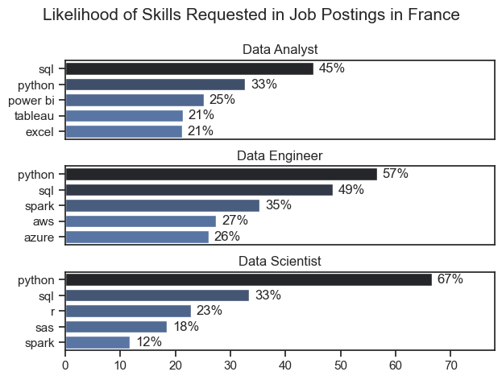
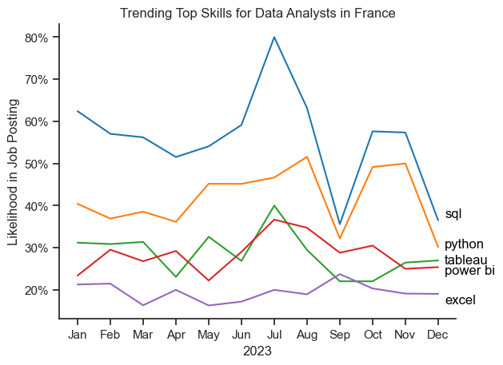

# The Analysis
Each Jupyter notebook for this project aimed at investigating specific aspects of the data job market. Here’s how I approached each question:
## 1. What are the most demanded skills for the top 3 most popular data roles?
To identify the most in-demand skills across the three most popular data roles, I first filtered the dataset to focus on the most common positions. Then, I extracted the top five skills associated with each of these roles. This analysis highlights the key job titles and their most relevant skills, helping me understand which competencies to prioritize based on the role I aim to pursue.
View my notebook with detailed steps here: [2_Skill_Demand](3_Project/2_Skill_Demand.ipynb)
### Visualize Data
```
fig, ax = plt.subplots(len(job_titles), 1)


for i, job_title in enumerate(job_titles):
    df_plot = df_skills_perc[df_skills_perc['job_title_short'] == job_title].head(5)[::-1]
    sns.barplot(data=df_plot, x='skill_percent', y='job_skills', ax=ax[i], hue='skill_count', palette='dark:b_r')

plt.show()
```
### Results


Bar chart illustrating the salaries for the top three data roles, along with the five key skills associated with each of them.
### Insights:
- SQL is a core skill across all three roles, ranking at or near the top every time, making it essential regardless of the data career path.
- Data Engineers stand out with more technical and infrastructure-focused requirements, including tools like Spark and cloud platforms (AWS, Azure), showing a stronger emphasis on big data and system architecture.
- Python is key for Data Scientists and Data Engineers, while Data Analysts rely more on business intelligence tools like Power BI, Tableau, and Excel, reflecting a more business-oriented role.

## 2. How are in-demand skills trending for Data Analysts?

To analyze how skills evolved throughout 2023 for Data Analysts, I filtered the dataset to include only relevant roles and grouped the required skills by the posting month. This allowed me to identify the top five skills for each month, highlighting how their popularity changed over the year.

View my notebook with detailed steps here: [3_Skills_Trend](3_Project/3_Skills_Trend.ipynb).

### Visualize Data

```
df_plot = df_DA_FR_percent.iloc[:, :5]
sns.lineplot(data=df_plot, dashes=False, legend=False, palette='tab10')

plt.gca().yaxis.set_major_formatter(PercentFormatter(decimals=0))

plt.show()
```
### Results

*Bar graph visualizing the trending top skills for data analysts in France in 2023.*

### Insights
- SQL remains consistently the most in-demand skill throughout the year, with a strong peak in mid-year before dropping sharply in September and recovering again toward the end of the year.
- Python follows a similar upward trend, gradually increasing to a peak in summer, suggesting higher demand for more technical analytical skills during that period.
- BI tools (Tableau, Power BI, Excel) show more stable but lower demand, with smaller fluctuations over time, indicating they are consistently required but less subject to strong seasonal variation compared to SQL and Python.

